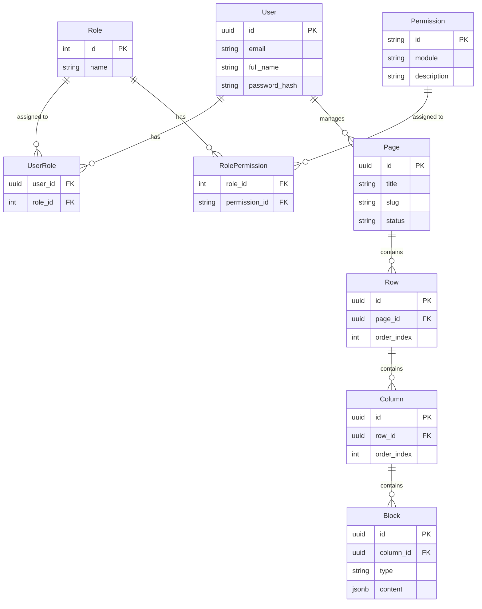

# 🗄️ DATABASE.md

## 1. Core Entities & Schema

### Users (Administrative Staff)

| Column | Type        | Description                         |
| ------ | ----------- | ----------------------------------- |
| `id`   | `UUID (PK)` | Unique ID for the User.             |
| `email`| `VARCHAR`   | User email (Unique).                |
| `full_name` | `VARCHAR`   | User full name.                     |
| `password_hash` | `VARCHAR` | Hashed password.                  |

### Roles & Permissions (RBAC)

- **Roles**: Defined user roles (e.g., `Admin`, `Staff`).
- **Permissions**: Granular actions (e.g., `cms.page.write`). Modules register their permissions via EDA.
- **Role Permissions**: Mapping between roles and permissions.
- **User Roles**: Mapping between users and roles.

### Pages (CMS Content)

| Column | Type | Description |
| ------ | ---- | ----------- |
| `id` | `UUID (PK)` | Unique ID for the Page. |
| `title` | `VARCHAR` | Page title. |
| `slug` | `VARCHAR` | URL-friendly identifier. |
| `seo_description`| `TEXT` | SEO description metadata. |
| `seo_keywords` | `TEXT[]` | SEO keywords metadata. |
| `status` | `VARCHAR` | Page status (`draft`, `published`, `archived`). |

### Rows, Columns & Blocks (CMS Layout)

- **Rows**: Vertical sections within a page. Supports `css_class` and `background_config` (JSONB).
- **Columns**: Horizontal divisions within a row. Supports responsive widths (`width_sm`, `width_md`, etc.) and `css_class`.
- **Blocks**: Content elements within a column. Supports `type` and `content` (JSONB).

### ER Diagram

